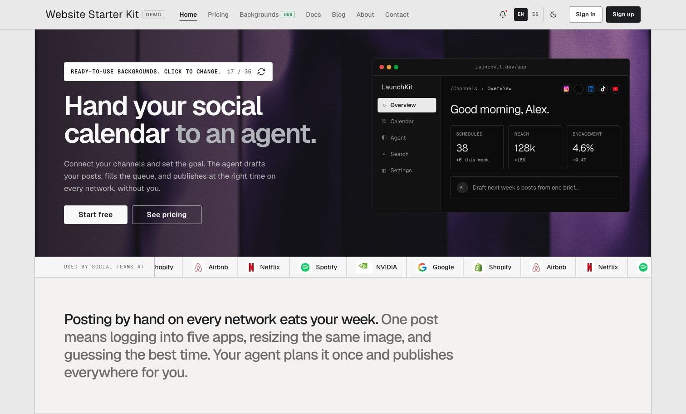
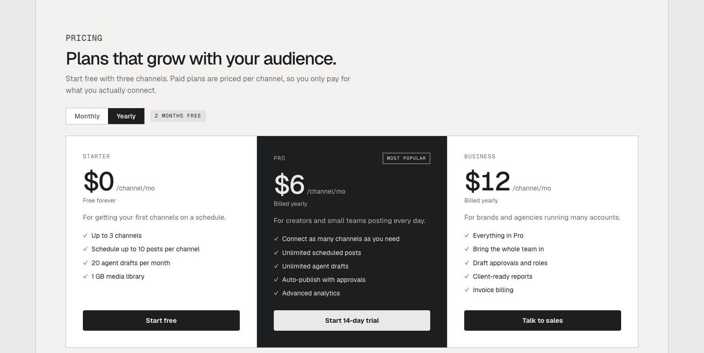
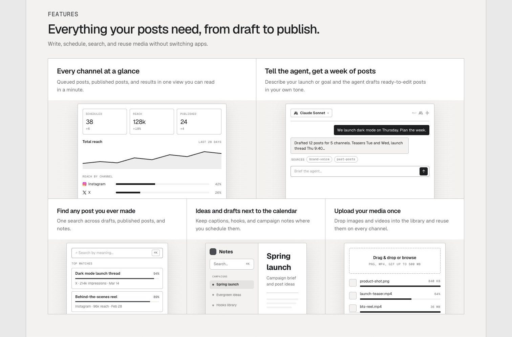

# SaaS Landing Page: Structure, Copy, and What Comes After Sign-Up

Template: [SaaS Landing Page on getdesign.md](https://getdesign.md/landing-page-templates/saas-landing-page) · Live demo: [starterkit-demo.getdesign.md](https://starterkit-demo.getdesign.md/)

[](https://getdesign.md/landing-page-templates/saas-landing-page)

A **SaaS landing page** has a fairly simple job: help the right visitor understand the product and decide whether to try it.

That sounds easier than it is. Most templates give you a hero, three feature cards, a pricing table, and some testimonials. They solve the layout. They do not decide what the page should say, which proof belongs near the top, or what happens when the visitor clicks the button.

The page before sign-up and the first product screen after it need to be planned as one path.

## The five questions the page must answer

A visitor does not read a SaaS page from top to bottom with equal attention. They scan, pause when something looks relevant, and leave when the page becomes vague.

The page needs to answer five questions quickly:

1. What is this?
2. Is it meant for someone like me?
3. What changes after I use it?
4. Why should I believe that?
5. What happens if I click?

Most weak pages spend too much space on question three and avoid the others. They promise faster work, better collaboration, or smarter decisions without saying what the product actually is.

Start with the plain description. Benefits become useful once the visitor knows what produces them.

## A section order that works

There is no mandatory SaaS landing page layout, but the argument usually works in this order:

### 1. Hero: what it is and who it is for

The headline should identify the product or the result in language the intended customer uses. The supporting sentence can explain how it works or narrow the audience.

A useful test: remove the logo and read the headline by itself. If it could belong to ten unrelated products, it is not doing enough.

The hero also needs one main action. "Start free," "Create an account," and "Book a demo" imply different products and different levels of commitment. Pick the one that matches the actual next step.

### 2. Proof before the long explanation

Visitors should not have to reach the bottom to find evidence. Put one credible signal near the hero: a product screenshot, customer logos you are allowed to use, a specific usage number, or a short quote with a real name and role.

If the product is new, show the product. A clear interface and a concrete workflow are better than invented social proof.

### 3. The product in use

Feature cards are easy to write and easy to ignore. A product view is harder to fake.

Show the starting state, the action, and the result. For a research tool, that might be an interview note becoming a tagged insight. For an analytics product, it might be a raw event becoming a decision someone can make.

One complete workflow usually explains more than six disconnected features.

### 4. Objections and fit

Once the visitor understands the product, answer the questions that block the decision. Setup time, integrations, security, switching costs, team size, and data ownership are common examples.

Do not add all of them because another SaaS page did. Use the objections your buyer actually has.

### 5. Pricing or the path to pricing

If the product has a simple self-serve price, showing it saves everyone time. If pricing depends on seats, volume, or implementation, explain what the visitor gets before asking them to book a call.

A pricing section should make the choice easier. Four plans with nearly identical feature lists do the opposite.

[](https://starterkit-demo.getdesign.md/)

### 6. A final action

Repeat the same primary action from the hero. The visitor has more context now, but the next step has not changed.

## Write the page around one buyer

The fastest way to make a SaaS landing page generic is to write for "teams."

A founder comparing billing tools, a support lead replacing a help desk, and a developer choosing an API do not need the same argument. They care about different proof, have different objections, and expect different language.

Before writing the page, finish this sentence:

```text
This page is for [specific role or company type] who currently [existing behavior]
and wants to [specific outcome] without [main cost or objection].
```

This is not necessarily the copy that appears on the page. It is the constraint that keeps the copy from drifting.

If the product genuinely serves several buyers, make the homepage about the shared problem and give the important segments their own pages. Trying to fit every use case into one hero usually produces a sentence nobody recognizes as theirs.

## Show the real product early

Many SaaS pages hide the interface behind abstract illustrations because the product is still changing. That is understandable during an early launch, but it weakens the page.

The visitor wants to know what using the product feels like. A screenshot answers questions about complexity, maturity, and fit without another paragraph of copy.

Use a screenshot that shows a meaningful state. An empty dashboard says very little. A dashboard with realistic sample data, a completed workflow, or a visible result gives the reader something to evaluate.

Keep the image readable on a laptop. Tiny text inside a full-width browser mockup is decoration, not a product demonstration.

## Treat the call to action as part of the product

The button label sets an expectation. The next screen has to keep it.

If the hero says "Start free," sending the visitor to a sales form feels like a trap. If it says "Book a demo," ask only for the information needed to arrange that demo. If it says "See how it works," do not open a checkout page.

This is where a finished landing page and an unfinished product often separate. The marketing surface looks ready, but the account flow, email verification, subscription state, and first product screen were treated as later work.

For a real launch, test the complete path from an anonymous visit to the first useful action inside the product. The page is only the beginning of that path.

## When a landing page template is enough

A template is enough when the page has a narrow job and the action is handled somewhere else.

Examples include a waitlist, an event registration page, a service with a booking link, or an early product page collecting emails. In those cases, a larger application starter adds complexity you may never use.

The calculation changes when sign-up opens an account, pricing starts a subscription, or the product needs a dashboard. Then the work behind the landing page is larger than the page itself.

## Starting with the web product already behind the page

[](https://getdesign.md/landing-page-templates/saas-landing-page)

The [Website Starter Kit](https://getdesign.md/website-starter-kit) is one way to start from both surfaces at once. The [SaaS Landing Page template](https://getdesign.md/landing-page-templates/saas-landing-page) is its original look, and the screenshots on this page come from its [live demo](https://starterkit-demo.getdesign.md/). It includes a marketing website and the web application behind it: authentication, roles, payments, subscriptions, product screens, AI chat, knowledge search, email, analytics, blog, documentation, and legal pages.

The private `DESIGN.md` and shared component system are useful after the homepage. They give an AI coding tool persistent visual rules for the account flow, pricing page, dashboard, and later screens instead of asking it to infer the design from one page.

This is not the right starting point for every SaaS idea. If you only need a waitlist this week, it is too much. It becomes relevant when the first release already needs accounts, billing, content, or a working product area.

## When the SaaS product is a mobile app

Some SaaS products are used mainly through an installed app. The website still explains the product, answers questions, and points to the stores, but the important onboarding and subscription flows live on iOS and Android.

The [Mobile Starter Kit](https://getdesign.md/mobile-starter-kit) covers that side with one Expo and React Native codebase. It includes sign-in, onboarding, navigation, push notifications, deep links, subscription states, RevenueCat connection points, AI chat, camera-to-AI flows, and App Store and Google Play release setup.

Use it when native behavior is part of the product. Do not choose it simply because the landing page receives mobile traffic; every SaaS page needs a good mobile layout, but not every SaaS product needs an app.

## Building the page with an AI coding tool

An AI tool can assemble a competent SaaS page quickly. The default result tends to be competent in the same way every time: centered headline, gradient accent, three cards, testimonial row, oversized pricing section.

Give it constraints that change the decisions.

```text
Build the SaaS landing page for a customer research tool used by product teams.

The primary visitor is a product manager who currently keeps interview notes
in documents and spreadsheets. The main action is to create a free workspace.

Use this section order:
1. Plain-language hero and product screenshot
2. One complete workflow from interview note to searchable insight
3. Proof and a named customer quote
4. Integrations and data ownership
5. Two pricing plans
6. FAQ and repeated sign-up action

Use the existing design system. Keep the current authentication, billing,
and analytics behavior unchanged. Check the result on mobile and desktop.
```

The useful details are not "modern" or "premium." They are the buyer, current behavior, main action, proof, objections, and boundaries the implementation must preserve.

## SaaS landing page checklist

Before publishing, check the page as a visitor rather than as the person who built it.

- The first screen says what the product is
- The intended buyer can recognize themselves
- The primary action is the same throughout the page
- At least one real product state appears near the top
- Proof is specific and verifiable
- Pricing or the route to pricing is clear
- The main objection is answered
- Forms and account flows work without an existing session
- Mobile navigation, screenshots, and pricing remain readable
- Page title, description, headings, and social preview match the final copy
- Unused scripts, demo content, and placeholder links are removed
- The first useful action after sign-up has been tested

## Frequently asked questions

### What is a SaaS landing page?

It is a page designed to explain a software product and move a specific visitor toward a next step, usually starting a trial, creating an account, joining a waitlist, or booking a demo.

### How long should a SaaS landing page be?

Long enough to explain the product, show proof, answer the main objection, and make the next step clear. A simple tool may need five sections. A product with a new category, higher price, or security concerns may need more. Section count is a poor target by itself.

### Should pricing appear on the landing page?

Usually, yes, when the price is standardized and the product is self-serve. For enterprise products with variable scope, explain the buying model and what the visitor can expect before asking for a call.

### Are SaaS landing page templates good for SEO?

A template can provide sound markup and responsive structure, but it cannot supply useful original content. Search performance still depends on clear intent, crawlable text, descriptive headings and metadata, fast loading, internal links, and pages that answer real questions about the product.

### What should the hero section include?

A clear headline, a supporting explanation, one primary action, and enough visual evidence to show what the product is. Avoid placing two equally prominent actions in competition with each other.

### Do I need testimonials before launching?

No. Do not invent them. Use a product screenshot, a concrete workflow, founder credibility, pilot results you can support, or a clear explanation of how the product works. Add testimonials when real customers give you something specific worth quoting.

### Should a mobile SaaS have a separate landing page?

It should have a web page that can be shared, indexed, and opened before installation. That page can point to both app stores and explain platform requirements, subscriptions, privacy, and the product's main workflow.

## The page and the product are one path

A good **SaaS landing page** makes the product easier to understand. A good launch also makes the next step feel continuous.

Write the page around one buyer. Show the product earlier than feels comfortable. Match the button to the screen that follows it. Then test the path all the way to the first useful result.

A clear page earns the click. A coherent first product experience makes that click worth something.
